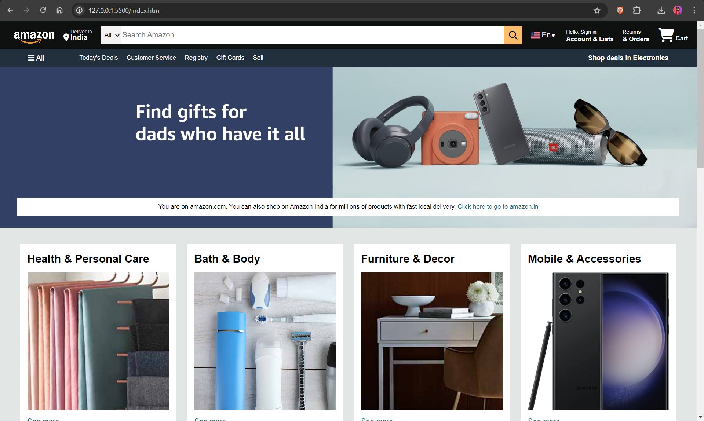

# Amazon Clone

This is a simple front-end clone of the Amazon website created using HTML and CSS.

## Description

This project serves as a practice exercise for implementing basic concepts of HTML and CSS to replicate the user interface of the Amazon website.

## Preview



## Technologies Used

- HTML
- CSS

## Getting Started

To view the Amazon Clone locally, follow these steps:

1. Clone this repository:

   ```bash
   git clone https://github.com/codernotme/amazon-clone
   ```
2. Navigate to the project directory:

    ```bash
    cd amazon-clone
    ```
3. Open the `index.html` file in your web browser.

## Contributing
Contributions are welcome! Please feel free to submit a pull request if you have any improvements or suggestions.
